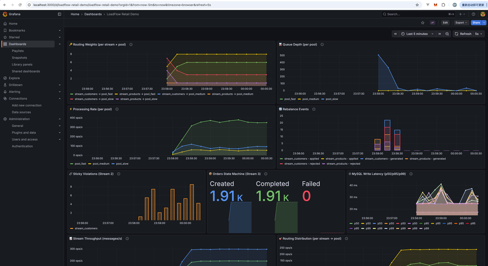
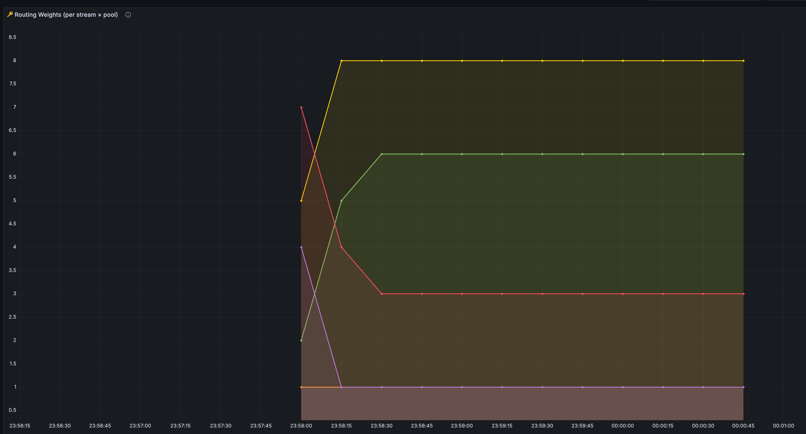
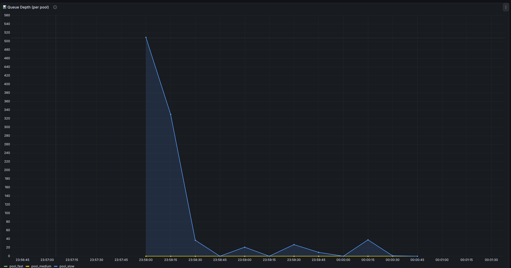
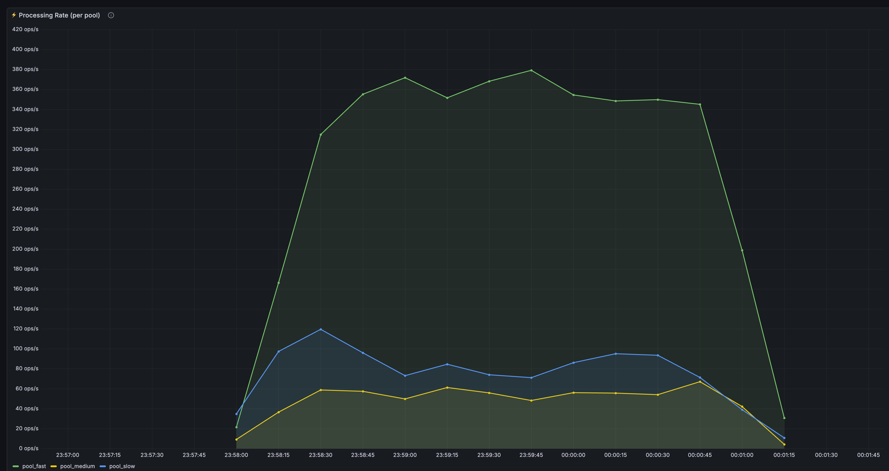
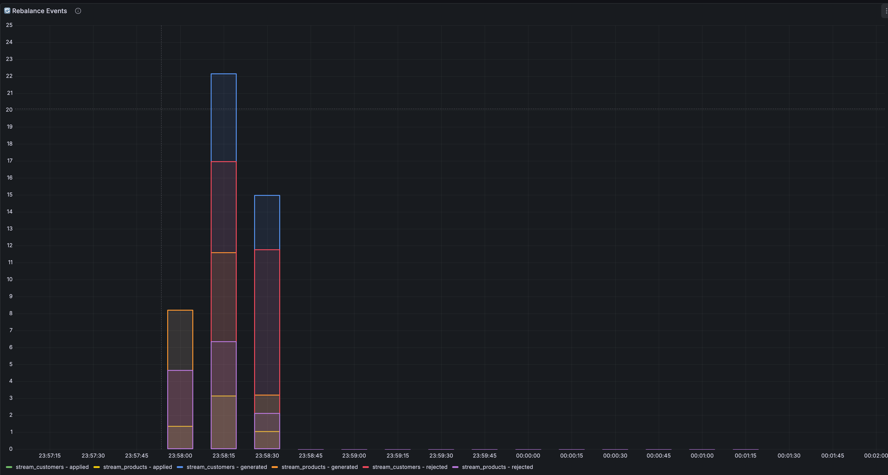
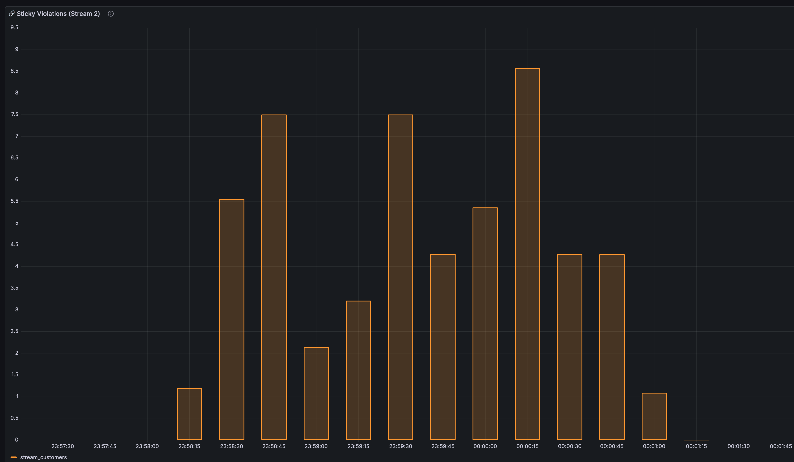
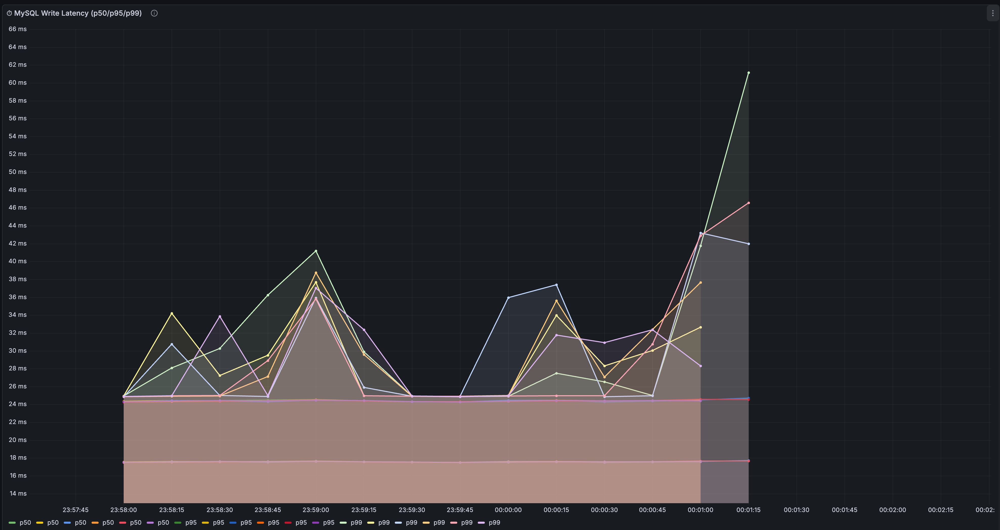
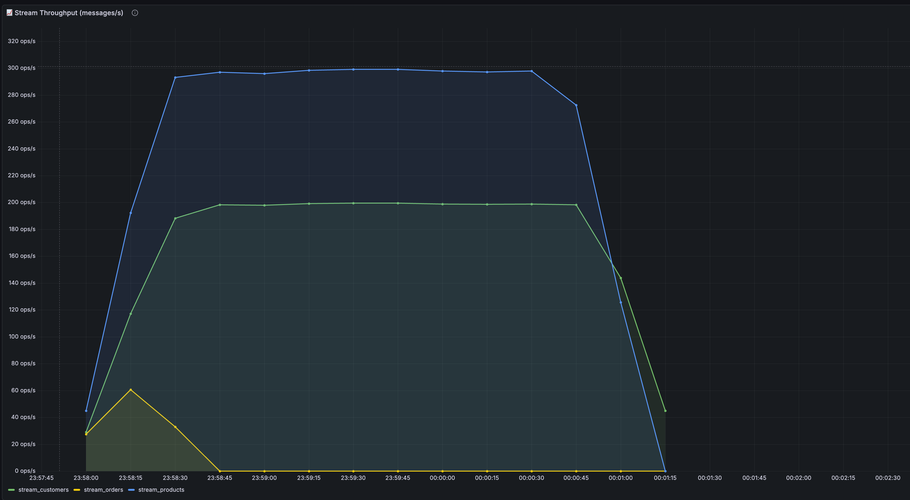
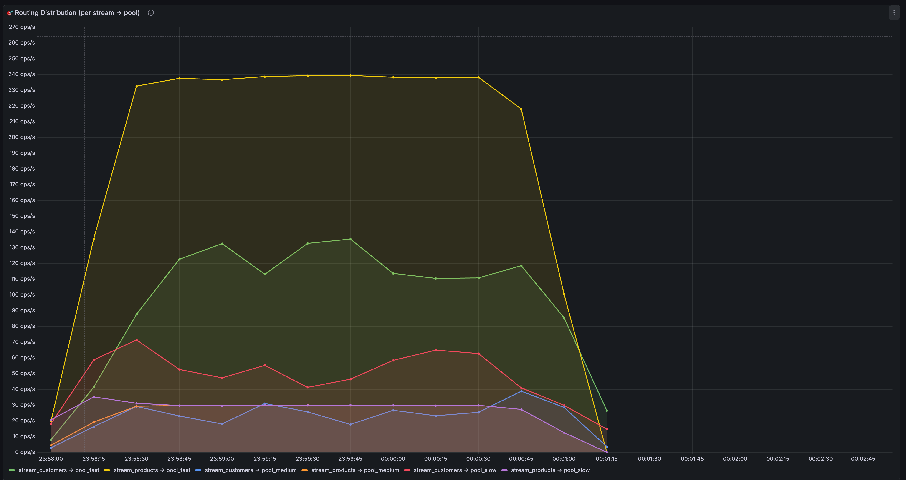

# LoadFlow Retail Demo — E-Commerce Data Pipeline Full-Scenario Showcase

> A real-world scenario demo built on the [LoadFlow](https://github.com/DrWhoRC/loadflow) framework, using the Kaggle [Online Retail II](https://www.kaggle.com/datasets/mashlyn/online-retail-ii-uci) dataset (~1.07M rows). CSV data flows through three differentiated Streams into MySQL, fully demonstrating **WRR weighted round-robin**, **sticky routing**, and **StripedPool strong ordering** — along with the **pressure\_rebalance dynamic rebalancing** mechanism. Real-time visualization via Prometheus + Grafana.

---
## Overall View in Grafana:


## Table of Contents

- [Architecture Overview](#architecture-overview)
- [Three Stream Designs](#three-stream-designs)
  - [Stream 1 — Product Catalog Bulk Import (Keyless WRR)](#stream-1--product-catalog-bulk-import-keyless-wrr)
  - [Stream 2 — Customer Transaction Aggregation (Sticky Routing)](#stream-2--customer-transaction-aggregation-sticky-routing)
  - [Stream 3 — Order State Machine (StripedPool Strong Ordering)](#stream-3--order-state-machine-stripedpool-strong-ordering)
- [pressure_rebalance Dynamic Rebalancing](#pressure_rebalance-dynamic-rebalancing)
- [Project Structure](#project-structure)
- [Quick Start](#quick-start)
  - [Prerequisites](#prerequisites)
  - [1. Start MySQL](#1-start-mysql)
  - [2. Start Prometheus + Grafana](#2-start-prometheus--grafana)
  - [3. Run the Demo](#3-run-the-demo)
  - [4. View the Grafana Dashboard](#4-view-the-grafana-dashboard)
- [Configuration Reference](#configuration-reference)
- [Run Results](#run-results)
- [Grafana Dashboard Walkthrough](#grafana-dashboard-walkthrough)
  - [Panel 1: Routing Weights](#panel-1-routing-weights)
  - [Panel 2: Queue Depth](#panel-2-queue-depth)
  - [Panel 3: Processing Rate](#panel-3-processing-rate)
  - [Panel 4: Rebalance Events](#panel-4-rebalance-events)
  - [Panel 5: Sticky Violations](#panel-5-sticky-violations)
  - [Panel 6: Orders State Machine](#panel-6-orders-state-machine)
  - [Panel 7: MySQL Write Latency (p50/p95/p99)](#panel-7-mysql-write-latency-p50p95p99)
  - [Panel 8: Stream Throughput](#panel-8-stream-throughput)
  - [Panel 9: Routing Distribution](#panel-9-routing-distribution)
- [Key Design Decisions](#key-design-decisions)
- [Tech Stack](#tech-stack)

---

## Architecture Overview

```
                   ┌─────────────────────────────────────────────────────────┐
                   │                     CSV Data Source                     │
                   │            Kaggle Online Retail II (50,000 rows)        │
                   └────────────┬──────────────┬──────────────┬──────────────┘
                                │              │              │
                    ┌───────────▼──┐  ┌────────▼───────┐  ┌──▼──────────────┐
                    │  Stream 1    │  │   Stream 2     │  │   Stream 3      │
                    │  Products    │  │   Customers    │  │   Orders        │
                    │  300 msg/s   │  │   200 msg/s    │  │   100 order/s   │
                    │  Keyless WRR │  │   Sticky Key   │  │   StripedPool   │
                    └──────┬───────┘  └───────┬────────┘  └───────┬─────────┘
                           │                  │                   │
                  ┌────────▼──────────────────▼────────┐   ┌──────▼──────────┐
                  │       WeightedRR Router            │   │  StripedPool    │
                  │  InstrumentedRouter (metrics)      │   │  8 stripes      │
                  │  + KeyTracker (violation detect)   │   │  per-key serial │
                  └─┬──────────────┬───────────────┬───┘   └──────┬──────────┘
                    │              │               │              │
              ┌─────▼────┐  ┌─────▼──────┐  ┌─────▼────┐  ┌─────▼────┐
              │pool_fast  │  │pool_medium │  │pool_slow │  │ dbFast   │
              │ 8 workers │  │ 4 workers  │  │ 2 workers│  │(ordering │
              │ queue=2048│  │ queue=1024 │  │ queue=512│  │ priority)│
              └─────┬─────┘  └─────┬──────┘  └────┬─────┘  └──────────┘
                    │              │               │
              ┌─────▼─────┐  ┌────▼──────┐  ┌─────▼─────┐
              │ dbFast     │  │ dbMedium  │  │ dbSlow    │
              │ MaxConn=20 │  │ MaxConn=5 │  │ MaxConn=2 │
              └─────┬──────┘  └────┬──────┘  └─────┬─────┘
                    │              │               │
                    └──────────────┼───────────────┘
                                   │
                          ┌────────▼────────┐
                          │     MySQL       │
                          │ loadflow_demo   │
                          └─────────────────┘
```

The **Scheduler** samples each pool's `PoolStat.Pressure` (= QueueDepth / ProcessRate) every second. When the delta between the highest-pressure and lowest-pressure pools exceeds the threshold, it triggers the `pressure_rebalance` strategy — **stealing weight from the overloaded pool and giving it to the underloaded pool** — achieving dynamic load balancing.

---

## Three Stream Designs

### Stream 1 — Product Catalog Bulk Import (Keyless WRR)

| Property | Value |
|----------|-------|
| Data Source | All CSV records (50,000 rows) |
| Routing Strategy | Keyless WRR (weighted round-robin, no key) |
| Initial Weights | `[1, 1, 8]` → 80% directed to `pool_slow` |
| Emission Rate | 300 msg/s |
| Handler | `ProductHandler` — deserialize → GORM `INSERT` → MySQL `products` table |
| Rebalancing | ✅ Enabled `pressure_rebalance`, cooldown=3s, maxStep=2 |

**Design Intent**: A pure-throughput scenario that doesn't care about message ordering. The initial weights are intentionally skewed, directing the vast majority of traffic to `pool_slow` (the pool with the fewest workers), causing rapid queue buildup and triggering `pressure_rebalance` to progressively shift weight to `pool_fast`.

### Stream 2 — Customer Transaction Aggregation (Sticky Routing)

| Property | Value |
|----------|-------|
| Data Source | Records with CustomerID (35,093 rows) |
| Routing Strategy | Sticky (keyed by `CustomerID`, affinity to pool) |
| Initial Weights | `[1, 1, 8]` |
| Emission Rate | 200 msg/s |
| Handler | `CustomerHandler` — in-memory per-customer total aggregation → GORM `INSERT` → MySQL `customer_transactions` table |
| Rebalancing | ✅ Enabled, cooldown=5s, maxStep=1 |

**Design Intent**: Demonstrates the business value of sticky routing — transactions for the same customer are always routed to the same pool, giving the handler's per-customer in-memory cache (`custTotals`) natural data locality with minimal concurrency contention. When `pressure_rebalance` adjusts weights, some keys migrate to a different pool, producing **sticky violations** clearly visible in Grafana. This showcases the **throughput vs. affinity trade-off**.

### Stream 3 — Order State Machine (StripedPool Strong Ordering)

| Property | Value |
|----------|-------|
| Data Source | Order events grouped by InvoiceNo (1,909 orders) |
| Routing Strategy | `StripedPool.SubmitWithKey` (keyed by `InvoiceNo`, same order executes serially within the same stripe) |
| Stripe Count | 8 |
| Queue Size | 256 per stripe |
| Handler | `OrderHandler.ProcessOrder` — state machine: `created → processing → completed` |
| Rebalancing | ❌ Disabled (ordering takes priority) |

**Design Intent**: Proves the business value of strong ordering. Each order goes through a three-step state machine:

1. **CREATE** — Create the order record (`status = 'created'`)
2. **INSERT ITEMS** — Add line items one by one; after the first item, status transitions to `processing`
3. **COMPLETE** — Update to `completed`, write the total amount

If these three steps execute out of order (e.g., COMPLETE before CREATE), the SQL `UPDATE ... WHERE status = 'processing'` would match zero rows and fail. StripedPool guarantees that all closures for the same `InvoiceNo` execute **serially** within the same stripe — all 1,909 orders succeeded with 0 errors.

---

## pressure_rebalance Dynamic Rebalancing

This is the core highlight of the demo. Algorithm flow:

```
Every tick (1s) sample:
  ┌──────────────────────────────────────────────────────────────┐
  │ For each stream, compute each pool's Pressure:               │
  │   Pressure = QueueDepth / ProcessRate                        │
  │                                                              │
  │ Find the maxPressure pool and minPressure pool               │
  │ delta = maxPressure - minPressure                            │
  │                                                              │
  │ if delta >= minPressureDelta (3.0):                          │
  │   deltaW = min(maxStep, calculated_step)                     │
  │   Steal deltaW weight from maxPressure → give to minPressure │
  │   Ensure weight doesn't drop below minWeight (1)             │
  │                                                              │
  │ Wait for cooldown, then sample again...                      │
  └──────────────────────────────────────────────────────────────┘
```

**Observed Rebalancing Process** (from actual logs):

**Stream 1 — Products** (cooldown=3s, maxStep=2):

| Time | Weight Change | Direction | deltaW | pressure_delta |
|------|--------------|-----------|--------|---------------|
| 23:57:51 | `[1,1,8]` → `[3,1,6]` | `pool_slow` → `pool_fast` | 2 | 252.00 |
| 23:57:54 | `[3,1,6]` → `[5,1,4]` | `pool_slow` → `pool_fast` | 2 | 3.94 |
| 23:57:58 | `[5,1,4]` → `[7,1,2]` | `pool_slow` → `pool_fast` | 2 | 3.98 |
| 23:58:02 | `[7,1,2]` → `[8,1,1]` | `pool_slow` → `pool_fast` | 1 | 3.98 |

Only **11 seconds** for 4 adjustments, flipping weights from `[1,1,8]` to `[8,1,1]` — an almost perfect mirror.

**Stream 2 — Customers** (cooldown=5s, maxStep=1):

| Time | Weight Change | Direction | deltaW | pressure_delta |
|------|--------------|-----------|--------|---------------|
| 23:57:51 | `[1,1,8]` → `[2,1,7]` | `pool_slow` → `pool_fast` | 1 | 252.00 |
| 23:57:57 | `[2,1,7]` → `[3,1,6]` | `pool_slow` → `pool_fast` | 1 | 3.98 |
| 23:58:03 | `[3,1,6]` → `[4,1,5]` | `pool_slow` → `pool_fast` | 1 | 3.94 |
| 23:58:09 | `[4,1,5]` → `[5,1,4]` | `pool_slow` → `pool_fast` | 1 | 3.29 |
| 23:58:15 | `[5,1,4]` → `[6,1,3]` | `pool_slow` → `pool_fast` | 1 | 3.52 |

With `maxStep=1` and `cooldown=5s`, Stream 2 adjusts more conservatively — taking about **24 seconds** for 5 adjustments. After stabilizing at `[6,1,3]`, `pressure_delta` drops below `< 3.0` and no further rebalancing is triggered.

---

## Project Structure

```
loadflow_demo_retail/
├── cmd/demo/
│   └── main.go                  # Main entry point (~726 lines)
├── config/
│   └── config.yaml              # Full configuration file
├── internal/
│   ├── csvloader/
│   │   └── loader.go            # CSV parser (3-way data split)
│   ├── handler/
│   │   ├── product.go           # Stream 1 Handler: product import
│   │   ├── customer.go          # Stream 2 Handler: customer transaction aggregation
│   │   └── order.go             # Stream 3 Handler: order state machine
│   ├── metrics/
│   │   └── prometheus.go        # Custom Prometheus metrics + KeyTracker + WeightReporter
│   └── model/
│       └── models.go            # GORM data models
├── deploy/
│   ├── docker-compose.yml       # Prometheus + Grafana container orchestration
│   ├── prometheus/
│   │   └── prometheus.yml       # Prometheus scrape config
│   ├── grafana/
│   │   ├── provisioning/
│   │   │   ├── datasources/
│   │   │   │   └── prometheus.yml
│   │   │   └── dashboards/
│   │   │       └── dashboards.yml
│   │   └── dashboards/
│   │       └── loadflow.json    # Pre-provisioned dashboard (9 panels)
│   └── mysql/
│       └── init.sql             # Database initialization script
├── online_retail_II.csv         # Kaggle dataset
├── go.mod
└── go.sum
```

---

## Quick Start

### Prerequisites

- **Go** 1.23+
- **MySQL** 8.x (locally installed, not Docker)
- **Docker & Docker Compose** (for Prometheus + Grafana)
- **Kaggle Dataset**: Download [Online Retail II](https://www.kaggle.com/datasets/mashlyn/online-retail-ii-uci), place the CSV file in the project root as `online_retail_II.csv`

### 1. Start MySQL

```bash
# Create the database
mysql -u root -p -e "CREATE DATABASE IF NOT EXISTS loadflow_demo CHARACTER SET utf8mb4 COLLATE utf8mb4_unicode_ci;"

# Or use the init script
mysql -u root -p < deploy/mysql/init.sql
```

> **Note**: Edit the `database.dsn` field in `config/config.yaml` with your MySQL password.

### 2. Start Prometheus + Grafana

```bash
cd deploy
docker compose up -d
```

Verify containers are running:

```bash
docker ps
# Should show loadflow-prometheus (9090) and loadflow-grafana (3000)
```

### 3. Run the Demo

```bash
cd /path/to/loadflow_demo_retail
go run ./cmd/demo/
```

The demo runs for about 3 minutes (`run_duration: 180s`), printing real-time logs:

- `[REBALANCE]` lines: details of each weight adjustment
- `[ProductHandler]`, `[CustomerHandler]`: insert progress
- `[Stream3]`: order submission progress
- Final `DEMO RESULTS` summary

### 4. View the Grafana Dashboard

Open your browser to:

```
http://localhost:3000/d/loadflow-retail-demo/loadflow-retail-demo
```

Default credentials: `admin` / `admin`

> The dashboard is auto-loaded via provisioning — no manual import needed.

---

## Configuration Reference

Core configuration is in `config/config.yaml`. Key parameters:

| Parameter | Value | Description |
|-----------|-------|-------------|
| `demo.max_rows` | 50000 | Limit CSV rows read (0=all) |
| `demo.run_duration` | 180s | Total run duration |
| `demo.handler_latency` | 15ms | Simulated I/O delay, making worker count the bottleneck |
| `demo.metrics_port` | 2112 | Prometheus metrics endpoint port |
| `pools[].workers` | 8 / 4 / 2 | Worker count for the three pools |
| `routing[].initial_weights` | `[1, 1, 8]` | Initial weights (intentionally 80% to slow) |
| `scheduler.tick` | 1s | Scheduler sampling interval |
| `scheduler.policies[].cooldown` | 3s / 5s | Cooldown between consecutive rebalances |
| `scheduler.policies[].params.minPressureDelta` | 3.0 | Minimum pressure delta to trigger rebalance |
| `scheduler.policies[].params.maxStep` | 2 / 1 | Maximum weight adjustment step per rebalance |

**Why `handler_latency`?**

Local MySQL `INSERT` latency is < 1ms — even `pool_slow` (2 workers) can easily handle ~2000 msg/s, far exceeding any stream's emission rate. With a 15ms simulated delay:

| Pool | Workers | Theoretical Throughput |
|------|---------|----------------------|
| `pool_fast` | 8 | ~533 msg/s |
| `pool_medium` | 4 | ~267 msg/s |
| `pool_slow` | 2 | ~133 msg/s |

Now `pool_slow` cannot absorb the 80% traffic assigned by initial weights (300×0.8 = 240 msg/s > 133), queues build up rapidly, `pressure_delta` instantly spikes to 252, and aggressive rebalancing kicks in.

---

## Run Results

Here is the final output from a complete demo run:

```
═══════════════════════════════════════════════════════════════
                    DEMO RESULTS
═══════════════════════════════════════════════════════════════
[Stream 1 - Products] Total inserted: 50000
[Stream 2 - Customers] Total inserted: 34726
[Stream 3 - Orders] Processed: 1909, Errors: 0
[StripedPool] Submitted=1909 Processed=1909 Panics=0
  Stripe-0: Submitted=241 Processed=241 QueueSize=0/256
  Stripe-1: Submitted=236 Processed=236 QueueSize=0/256
  Stripe-2: Submitted=232 Processed=232 QueueSize=0/256
  Stripe-3: Submitted=240 Processed=240 QueueSize=0/256
  Stripe-4: Submitted=242 Processed=242 QueueSize=0/256
  Stripe-5: Submitted=241 Processed=241 QueueSize=0/256
  Stripe-6: Submitted=237 Processed=237 QueueSize=0/256
  Stripe-7: Submitted=240 Processed=240 QueueSize=0/256

[Router] Final snapshot:
  stream_products -> pool_fast*8,pool_medium*1,pool_slow*1
  stream_customers -> pool_fast*6,pool_medium*1,pool_slow*3

[Bindings] Final weights:
  stream_products: pools=[pool_fast pool_medium pool_slow] weights=[8 1 1]
  stream_customers: pools=[pool_fast pool_medium pool_slow] weights=[6 1 3]

[DB Verification] Orders: total=1909, completed=1909
═══════════════════════════════════════════════════════════════
```

**Key Takeaways**:

- **Stream 1**: All 50,000 product records successfully written to MySQL
- **Stream 2**: 34,726 customer transactions written within 3 minutes (out of 35,093 source records — the remainder were not sent due to context timeout)
- **Stream 3**: All 1,909 orders completed the full state machine — **0 errors** — proving StripedPool ordering guarantees are intact
- **StripedPool** stripes are evenly loaded (236–242), demonstrating good hash distribution
- **Products weights**: Converged from `[1,1,8]` to `[8,1,1]` (complete inversion)
- **Customers weights**: Converged from `[1,1,8]` to `[6,1,3]` (softer convergence)

---

## Grafana Dashboard Walkthrough

The dashboard contains 9 panels. Below is a detailed walkthrough of each:

### Panel 1: Routing Weights



**PromQL**: `loadflow_router_weight`

**What to Observe**:

This is the most important panel in the entire demo. It shows 6 lines (2 streams × 3 pools), clearly presenting the **staircase-style rebalance** process:

- **Yellow line** (stream_products → pool_fast): Climbs in steps from **1** to **8**, jumping 2 at a time (`maxStep=2`)
- **Pink line** (stream_products → pool_slow): Drops from **8** to **1** in steps — a perfect mirror of the yellow line
- **Green line** (stream_customers → pool_fast): Slowly climbs from **1** to **6**, stepping 1 at a time (`maxStep=1`)
- **Red line** (stream_customers → pool_slow): Gradually descends from **8** to **3**
- **Purple/middle lines** (pool_medium for both streams): Remain fixed at **1** throughout — pool_medium is neither the highest nor lowest pressure pool, so it never participates in weight stealing

**Key Observations**:
1. The two streams converge at noticeably different speeds — Products (cooldown=3s, maxStep=2) is aggressive, Customers (cooldown=5s, maxStep=1) is conservative
2. Once converged, weights stabilize — because pressure_delta falls below the 3.0 threshold
3. pool_medium is the "invisible player" — its unchanging weight means its pressure always sits between fast and slow

---

### Panel 2: Queue Depth



**PromQL**: `loadflow_pool_pool_queue_depth`

**What to Observe**:

- **Blue line (pool_slow)**: Instantly spikes to **~500+** at startup (queue capacity is 512 — nearly full!), because 80% of traffic floods into the pool with only 2 workers
- As rebalancing takes effect (weight drops from 8), pool_slow's queue depth plummets within ~15 seconds, eventually reaching zero with small fluctuations
- **Orange line (pool_medium)** and **green line (pool_fast)**: Stay near 0 throughout — they have enough workers to handle their allocated traffic
- In the latter half, pool_slow shows small pulses (~20-30) — residual traffic from stream_customers (final weight `[6,1,3]`, pool_slow still gets 30%)

**This panel visually demonstrates the rebalancing effect**: from "one pool nearly full, others idle" to "load balanced across pools".

---

### Panel 3: Processing Rate



**PromQL**: `rate(loadflow_pool_pool_processed_total[30s])`

**What to Observe**:

- **Green line (pool_fast)**: Steady-state at about **350–380 ops/s**, the system workhorse. Theoretical ceiling is 8 workers × (1000/15) ≈ 533 ops/s, but actual throughput is limited by routing weights and injection rate
- **Blue line (pool_slow)**: Steady-state around **70–90 ops/s**, close to the theoretical 2 workers × 66.7 ops/s (running at full capacity)
- **Orange line (pool_medium)**: About **50–60 ops/s**, relatively stable

The three lines clearly reflect the **combined effect of worker count difference × weight allocation**. pool_fast receives the most weight and has the most workers — dominating throughput.

Note: At the end of the demo (right side), all lines drop sharply to 0 — data transmission is complete, queues drain.

---

### Panel 4: Rebalance Events



**PromQL**: `increase(loadflow_rebalance_plan_total[30s])`

**What to Observe**:

This is a **bar chart** showing the distribution of three rebalance event types on the timeline:

- **Blue (generated)**: The Scheduler produced an adjustment plan
- **Orange (applied)**: The plan was successfully applied — weights actually changed
- **Red (rejected)**: The plan was rejected (e.g., `maxPressure pool weight already at minimum 1`)

**Chart Interpretation**:

- First ~30s (23:58:00 – 23:58:30): **Dense generated + applied bars** — this is the highest-pressure phase with the most active rebalancing
- Accompanied by many **rejected** events — when pool_slow's weight has already dropped to `minWeight=1`, the strategy keeps trying to steal weight but gets rejected
- After 30s, bars virtually disappear — the system reaches steady state with `pressure_delta < 3.0`, no new plans are triggered

This panel helps you understand **rebalancing density and timing** — aggressive at the start, convergent later.

---

### Panel 5: Sticky Violations



**PromQL**: `increase(loadflow_routing_violations_total[30s])`

**What to Observe**:

This is an **orange bar chart** showing the number of sticky routing violations for Stream 2 (stream_customers) in each time window.

- Sticky violation = A `CustomerID` was previously routed to pool_A, but due to rebalancing changing the weights, it now gets routed to pool_B
- **23:58:15 – 23:58:45** (active rebalancing period): Highest violation count, peaking at **~7–8 per 30s**
- **After 23:59:00** (stable weight period): Violations persist but at a lower rate, about **3–5 per 30s**
- **00:00:15**: A spike (~8.5), likely caused by a WRR counter cycle boundary effect

**Why do violations persist in steady state?**

Even when weights are no longer changing, WRR (weighted round-robin) distribution within a cycle isn't perfectly deterministic. A key hashed to the same value may land on a different slot within the cycle. This is a known trade-off of WRR + Sticky — for 100% sticky guarantees, a Consistent Hashing router should be used.

**Business Impact**: The violation count is low (~60 total over 3 minutes), representing only ~0.17% of 34,726 records — perfectly acceptable for most business scenarios.

---

### Panel 6: Orders State Machine

**PromQL**:

- `loadflow_orders_created_total`
- `loadflow_orders_completed_total`
- `loadflow_orders_failed_total`

**What to Observe**:

This is a **Stat panel** (large number display) showing three counters:

| Metric | Value | Meaning |
|--------|-------|---------|
| **Created** | 1909 | Number of orders successfully created |
| **Completed** | 1909 | Number of orders that completed the full lifecycle |
| **Failed** | 0 | Number of orders that failed state transition |

**Created = Completed = 1909**, **Failed = 0** — this is the most powerful proof of StripedPool's **strong ordering guarantee**.

If Stream 3 used a regular unordered pool instead, `UPDATE ... WHERE status = 'processing'` executing before `INSERT` would match zero rows, resulting in `Failed > 0`.

---

### Panel 7: MySQL Write Latency (p50/p95/p99)



**PromQL**:

```promql
histogram_quantile(0.50, rate(loadflow_db_write_duration_seconds_bucket[30s]))  -- p50
histogram_quantile(0.95, rate(loadflow_db_write_duration_seconds_bucket[30s]))  -- p95
histogram_quantile(0.99, rate(loadflow_db_write_duration_seconds_bucket[30s]))  -- p99
```

**What to Observe**:

Multiple lines correspond to p50, p95, and p99 percentiles for different `{stream, pool}` combinations. Since the handler includes `time.Sleep(15ms)` for simulated delay, actual latency = 15ms simulation + real MySQL write time.

- **p50 (median)**: Mostly around **16–18ms** (15ms simulation + ~1–3ms MySQL)
- **p95 (95th percentile)**: About **24–30ms**, occasionally jumping to 35ms — reflecting MySQL connection pool contention and OS scheduling jitter
- **p99 (99th percentile)**: About **25–38ms**, higher tail latency
- During the demo's final phase (00:01:00 – 00:01:15), a **p50 spike to ~60ms** appears — this is the queue-draining phase where remaining tasks complete in a burst, compounded by MySQL connection pool recycling

**The p50/p95/p99 three-tier percentile breakdown** is the standard approach for observing database performance:
- **p50** represents the "typical experience" — the latency most requests see
- **p95** represents "slow requests" — the slowest 1 in 20 requests, commonly used as the SLA baseline
- **p99** represents "extreme tail latency" — the slowest 1 in 100 requests, reflecting worst-case system behavior under pressure. The lower the p99/p50 ratio (about 1.5–2x in this demo), the more stable the system's latency profile

---

### Panel 8: Stream Throughput



**PromQL**: `rate(loadflow_stream_messages_in_total[30s])`

**What to Observe**:

- **Blue line (stream_products)**: Steady-state at about **~300 ops/s**, precisely matching the configured `rate: 300`
- **Green line (stream_customers)**: Steady-state at about **~200 ops/s**, matching configuration
- **Yellow line (stream_orders)**: About **30–60 ops/s**, briefly spikes at the start then quickly drops to zero — because there are only 1,909 orders, all submitted in less than 30 seconds

**Note the ending cadence of stream_products**: The blue line starts declining around 00:00:42 (`[Stream1] All 50000 records sent`), while the green line is cut off at 00:00:50 (context timeout). This means all 50,000 products were sent at a constant 300 msg/s over ~2 minutes 52 seconds (50000 / 300 ≈ 167s), matching the theoretical value.

---

### Panel 9: Routing Distribution



**PromQL**: `rate(loadflow_router_routed_total[30s])`

**What to Observe**:

This panel shows **the actual rate at which each stream's traffic is distributed to each pool** — it's the direct projection of Panel 1 (weights) in the traffic dimension.

- **Yellow line (stream_products → pool_fast)**: Steady-state at about **230–240 ops/s** — 80% of stream_products total traffic (weight 8/10)
- **Green line (stream_customers → pool_fast)**: About **110–130 ops/s** — 60% of stream_customers (weight 6/10)
- **Red line (stream_customers → pool_slow)**: About **50–60 ops/s** — weight 3/10
- **Blue/purple lines (→ pool_medium)**: Each stream sends about **25–30 ops/s** — weight 1/10

**This panel is most valuable when cross-referenced with Panel 1**: Panel 1 shows "how weights change", Panel 9 shows "how traffic actually distributes". You can see that after rebalancing changes the weights, the traffic distribution follows immediately in the next second with no delay.

---

## Key Design Decisions

### Why Bypass the Runtime Message Pipeline?

LoadFlow's `Runtime` provides a complete Source → JSONCodec → Router → Pool → Handler pipeline. However, in this demo we call `router.Route()` + `pool.Submit()` directly with closures for the following reasons:

1. **Handler context awareness**: Closures can capture `poolName` to select the corresponding DB connection. In the Runtime pipeline, the handler only receives payload bytes and doesn't know which pool it's running in
2. **Flexible delay injection**: `time.Sleep(handlerLatency)` lives inside the closure, giving precise control over each task's execution time
3. **Still leverages Runtime's PoolStat collection**: By calling `rt.RegisterPool()` + `rt.UseRouter()`, the Scheduler's `RuntimeMetricsProvider` can still correctly capture each pool's `QueueDepth` and `ProcessRate`

### Why Does pool_medium's Weight Never Change?

The `pressure_rebalance` strategy only operates on the **maxPressure** and **minPressure** endpoints each tick. pool_medium's pressure always sits between fast and slow (neither the maximum nor the minimum), so it never participates in weight stealing. This is the strategy's expected behavior — it focuses on correcting the most pronounced imbalance rather than adjusting all pools simultaneously.

### The Protective Role of `minWeight=1`

The configuration `minWeight: 1.0` ensures every pool retains at least weight 1 and is never completely removed from the routing table. In the logs, you can see numerous `max pressure pool weight 1 already at minimum 1` messages — meaning the strategy attempted to further reduce pool_slow's weight to 0, but was blocked by the minWeight rule.

---

## Tech Stack

| Component | Version / Notes |
|-----------|----------------|
| **LoadFlow** | `github.com/DrWhoRC/loadflow` v0.1.1+ (main branch) |
| **Go** | 1.23+ |
| **MySQL** | 8.x (locally installed) |
| **GORM** | v1.31 |
| **Prometheus** | Docker (`prom/prometheus:latest`) |
| **Grafana** | Docker (`grafana/grafana:latest`) |
| **Dataset** | Kaggle Online Retail II (~1.07M rows, CSV) |
| **Prometheus Client** | `prometheus/client_golang` v1.23 |
